# Coding a two-wheeled robot with a Bayesian Analysis Approach

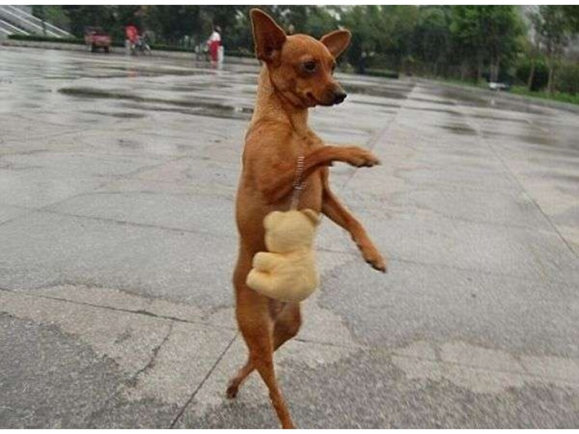

Balancing robots have always been a fascinating concept to me. Although it's second-nature to us to stand upright, watching a 1 year old baby or robot do the same feels so surreal. The vulnerability of unstable footing seems so humanizing - counter to the traditional notion of a rugged, calculated, robot. And with the recent introduction of low cost sensor electronics, building a robot to emulate this movement is within reach of any electronics hobbyist. 

So let's first stop and think about how we balance on our two feet. When we feel that we are falling forward, we take a step forward, and when we feel we are falling backward, we take a step back. This same idea goes for two wheeled robots; If the robot knows its leaning in one direction, it can correct itself by driving in the direction of that lean. Therefore, the only information needed in order to keep a two-wheeled robot upright is the degree of this lean. This seems simple enough... so let's design a robot to automate this balancing act!

**OK, so how can we measure this lean angle?**

An accelerometer sensor can provide us with an *angle*(lean) measurement. Additionally, a gyroscope sensor can measure an *angular velocity*, giving us even more information on this lean. Ok let's collect some data where the robot is being held in perfect steady balance, not moving and straight upright.

 <p align="center">
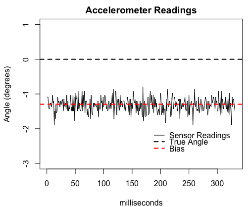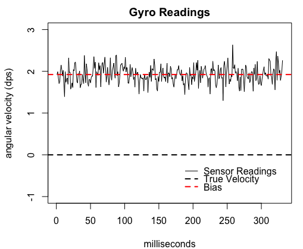
</p>
Looking at these graphs you might ask, 
*Wait, why aren't these sensors reading zero degrees? And why do the measurements jump around?*
 
Unfortunately, robotic sensors aren't perfect; all sensors are subject to bias and noise in their readings to some degree. This can be due to a variety of factors that can't be controlled including stray magnetic fields, ambient temperature, manufacturing tolerances, etc. 

If we want accurate readings of the lean angle, we will need to learn how to deal with these issues.
How did we decide to accomplish this? **Bayesian methods!**

Problem | Solution
--- | ---
Identify Bias and Noise in the Sensors | Bayesian Estimation
Make Predictions for the Current Angle | Recursive Bayesian Updating

Once we can answer these two problems, we can figure out an accurate lean angle, and finally drive the motors to balance the robot.


 Let's jump into our Bayesian approach solutions.
## Problem 1:  Identifying Bias and Noise in the Sensors
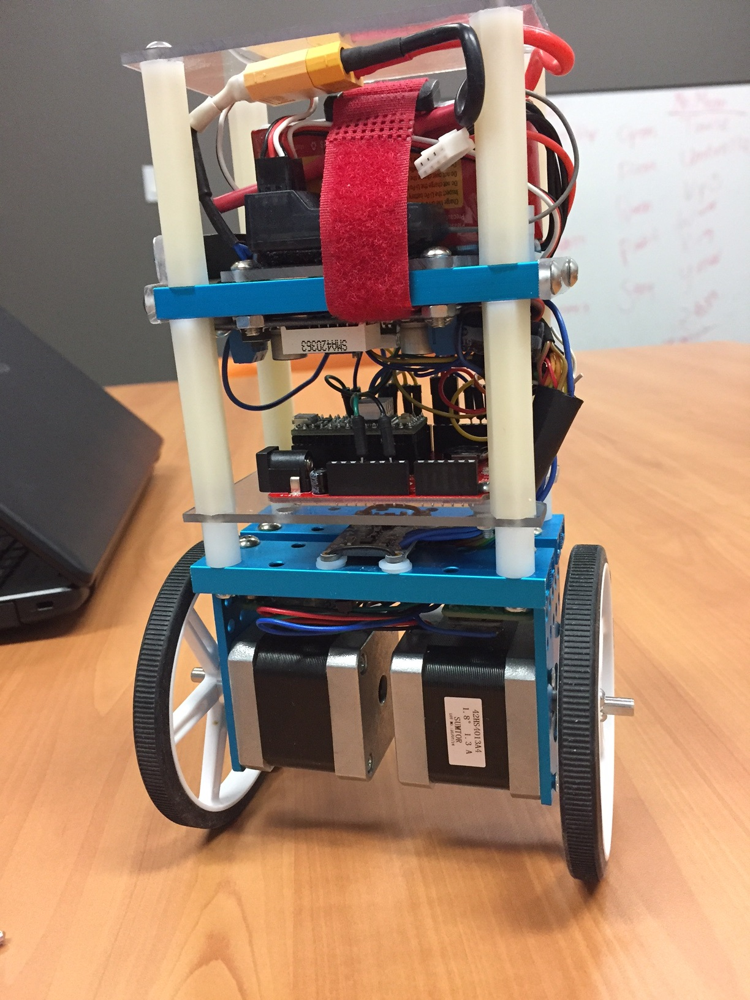
In order to trust the sensor readings we will need to first figure out how the reading relates to the true lean angle. So the first step we need to do is to figure out how the sensor data is distributed when the sensors are being held at a known angle (0 degree lean). This is like doing a calibration of the sensors every time the the robot is turned on.
#### How is the sensor data distrubuted?
We assume is that the data is normally distributed, centered at some bias amount , and noise amount . We can think of the sensor noise as the summation of many small unknown distribution random variables coming from things like stray magnetic fields, temperature etc., thus invoking the central limit theorem and consequently, a normal distribution.
 <p align="center">
 
 </p>
 where y is the observed sensor reading.
#### What are the parameters for this normal distribution?
Now that we know that the sensor data is normal, we must determine the distribution parameters of each sensor. But WAIT! We don't know what the noise level is OR the amount of bias... Both are unknown to us...
From here we take on a Bayesian approach to estimating these parameters.
### Bayesian Estimation of Sensor Bias and Noise
#### Prior Distribution Formulation
While we don't know what the bias and noise values truly are, we do however have some information from the manufacturer on what these values should *approximately* be.

###### Accelerometer Datasheet Information [pdf](https://cdn-shop.adafruit.com/datasheets/LSM303DLHC.PDF)

  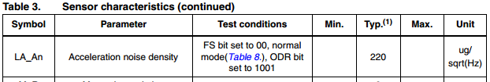

###### Gyroscope Datasheet Information [pdf](http://www.st.com/content/ccc/resource/technical/document/datasheet/35/b1/e0/39/71/57/43/01/DM00060659.pdf/files/DM00060659.pdf/jcr:content/translations/en.DM00060659.pdf)

 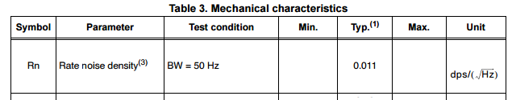

 

Sensor | Manufacturer's Bias Estimate | Manufacturer'as Noise Estimate
--- | --- | ---
Accelerometer | 0 | 0.030 degrees^2
Gyroscope | 0 | 0.048 dps^2


We'll now use this information to form our own belief of the bias and noise parameters:

 
Sensor | Our Bias Belief | Our Noise Belief
--- | --- | ---
Accelerometer | 95% between -3 and 3 | 95%  between 0 and 0.05
Gyroscope |  95% between -2 and 2  |  95%  between 0 and 0.08


By using a conjugate prior distribution for an unknown mean and unknown variance normal sampling distribution we arrive at a Normal-Inverse-Chi-Squared distribution.
We then can compute parameters for an informative prior distribution for each sensor by incorporating our beliefs.
 <p align="center">


</p>

 <p align="center">
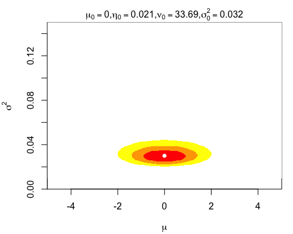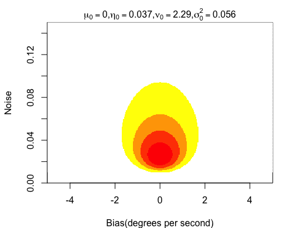
</p>
Now that we have our prior distributions set, we can now go ahead and collect some data.
#### Data Collection
The way we do this on the robot is by quickly collecting 50 readings within the first  half of a second of turning the robot on. The robot needs to be carefully held at an angle that we suspect will keep the robot balanced.
#### Posterior Distribution Estimates
Each posterior distribution will be formulated as follows:


where n=50, and s^2 is the variance of the 20 observed readings.
Knowing this, our posterior means for bias and noise are  
With these simple derivations it becomes simple enough to code up the estimates in just a few lines of code!
```C
/* BEGIN CALIBRATION */

//collect 50 readings
for (int i=1 ; i<=50 ; i++){

	gyro_obs[i] = readGyro(); //take a gyroscope observation
	acc_obs[i] = readAcc(); //take an accelerometer observation
	delay(10); //delay 10 milliseconds before reading the next set of observations
}

//gyroscope observation statistics
gyro_var = variance(gyro_obs); //sample variance
gyro_sum = sum(gyro_obs); //sum

//accelerometer observation statistics
acc_var = variance(acc_obs); //sample variance
acc_sum = sum(acc_obs); //sum

/* calculate posterior parameters */
// accelerometer noise and bias
n=50; eta0=0.021; nu0=33.69; sigma0=0.032; s_2=acc_var;
acc_noise_estimate=(1/(nu0+n))*(nu0*sigma0+(n-1)*acc_var +(eta0*n*s_2)/(eta0+50));
acc_bias_estimate=acc_sum/(n+eta0);

// gyro noise and bias
n=50; eta0=0.037; nu0=2.29; sigma0=0.056; s_2=gyro_var;
gyro_noise_estimate=(1/(nu0+n))*(nu0*sigma0+(n-1)*acc_var +(eta0*n*s_2)/(eta0+50));
gyro_bias_estimate=gyro_sum/(n+eta0);

muC=[acc_bias_estimate, gyro_bias_estimate];
sigmaC=[acc_noise_estimate, gyro_noise_estimate];
/* END CALIBRATION */
```

Alright cool, now we have estimates for bias and noise for each sensor!
Let's now move on to how we'll go about estimating the true lean angle given new observations.
## Problem 2: Making Predictions on the Current Angle 
 Once the calibration is completed, the robot will now be left on its own to balance. It's at this point where the true angle will *stray* from zero. In fact, it will probably start falling in one direction. Therefore the robot needs to quickly find its bearings and correct itself before that fall actually happens.  And since a fall can happen in a matter of milliseconds, we'll need to quickly figure out the true current angle after each and every sensor reading.


### Recursive Bayesian Updating
As we had discussed earlier, the distribution of sensor readings should come from a normal distribution centered around our belief of the true angle and a variance given from the noise we found during the calibration step. Also, since we are dealing with an update at each timestep(1/100th of a second), we use the subscript t to identify which time step we are referring to.


Where  is a 2x1 vector of the estimated biases and  is a 2x2 diagonal covariance matrix of the estimated noises we found in problem 1.
And where  is a 2x1 vector of our belief of what the true lean angle and true angular velocity is at time t.
#### Prior Formulation

OK, so this time around, the true angle is unknown and the noise is known. So how do we come up with our belief in the true lean angle and formulate a prior? 

A Bivariate Normal is the conjugate prior so  

*What information do we have available to formulate our belief and set these prior parameters?*

- Our belief of where the true angle and true angular velocity was at time t-1


- where physics would predict the next true angle to be
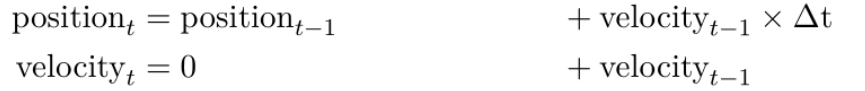

We can represent this physics transformation in matrix form as:


So to find the distribution of   we can derive the parameters as follows:


Before we go any further, we must first acknowledge that using those physics equations don't account for all changes from timestep to timestep! In those equations we see that we assume that velocity is constant which is NOT true! Since we cannot account for all disturbances to the angle or angular velocity from time step to time step, the simplest way to ease this issue is to inject extra uncertainty in our belief. When there is a large change in angular velocity from the previous time step(angular acceleration), we are less sure in our belief of the current angle and thus we increase the uncertainty linearly with angular acceleration.

So let's redefine  as:
 

where 

*This variance matrix can be derived by assuming that angular acceleration is constant and that the expected noise level is equal to the change in velocity between time steps*

Therefore our final prior distribution parameters can becomputed as functions of previous distribution parameters.

#### Posterior
Finally, the posterior distribution can be derived to be:


And our true angle and true angular velocity beliefs are simply:
 = 

The "true angle belief" will then get passed off to code which can convert an angle into drive motor inputs.

These posterior will then be recycled as part of the prior for the next time step and the next.

Phew, all done!
Now let's get to the code:
```C


/* BEGIN UPDATE STEP */

//loop indefintely
while(1){
	//take some readings
	acc_read = readAcc(); //take an accelerometer observation
	gyro_read = readGyro(); //take a gyroscope observation
	y=[acc_read,gyro_read];
	
	//move up one timestep and calculate new prior parameters
	sigmaPrior=A*sigmaPost*transpose(A)+sigmaQ*(muPost[1]-y[1]);
	muPrior=A*muPost;
	
	//calculate new posterior parameters
	sigmaPost=inverse(inverse(sigmaPrior)+inverse(sigmaC));
	muPost=sigmaPost*(sigmaPrior*muPrior+sigmaC*(y-muC));

	
	///////////////////////////////////////////
	pass muPost to motor control code to rebalance...
	///////////////////////////////////////////

	delay(10); //delay 10 milliseconds before starting the next update
}

/* END UPDATE STEP */
```

When this process gets repeated, we can see how this Bayesian updating does a fairly good job at smoothing out the noise issues with the sensors.
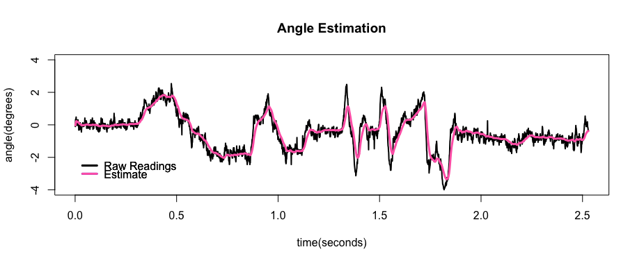
We can also see how   changes over time. As we see greater disturbances in the angle from time step to time step, we see that our uncertainty in our prior distribution increases:
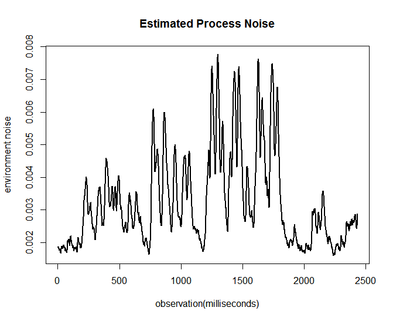


Now that we've got an estimate for the current angle of the robot, we can now drive the motors in a way that automatically balances it.  This involves knowledge of control systems and microcontroller hardware interrupts. Code for this part is in the INO file however both concepts are beyond the scope of this writeup but can be researched below:

https://en.wikipedia.org/wiki/PID_controller

https://arduinodiy.wordpress.com/2012/02/28/timer-interrupts/


## Future Work
1. Try doing sensor calibration using a Hierarchical Bayes approach.
 - Each time we start up the robot and calibrate, the realized bias comes from a hyperprior distribution.
 - each time we calibrate, we are ignorant to any differences that might affect bias thus giving us exchangeability. *(we know that ambient temperature and battery voltage can affect bias and noise but we don't have temps and voltages available as known data)*
2. Try to incorporate the uncertainty in our bias estimates in our updating step. As of now, this information is not used in the analysis.
3. Increase the sample size per update. The current setup updates the model after each and every observation 100 times per second. If we increase the sample rate to 500 times per second and update 25 times per second, we can obtain 20 readings for each update. According to the manufacturer's datasheet, sampling at higher rates increases the noise but collecting more data per update allows us to do some posterior predictive checking. 

<a href="http://www.youtube.com/watch?feature=player_embedded&v=K-8RJ1lW92k
" target="_blank"></a>


## References

- Gelman, Andrew. *Bayesian Data Analysis*. Chapman & Hall CRC, 2014. Print.

- Dr. Bee Leng Lee. Lecture slides. Math 264, SJSU. Fall 2016.

- *LSM303DLHC: Ultra-compact high-performance eCompass module: 3D accelerometer and 3D magnetometer*. ST Electronics. Nov 2013. No 018771. Rev. 2

- *L3GD20H MEMS motion sensor: three-axis digital output gyroscope*. ST Electronics. March 2013. No 023469. Rev. 2
